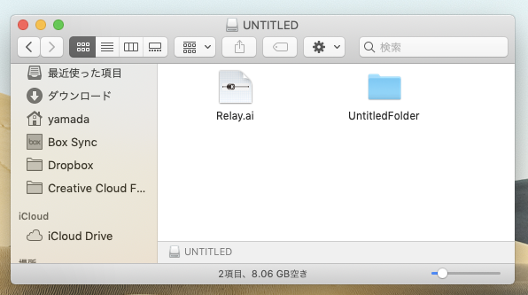
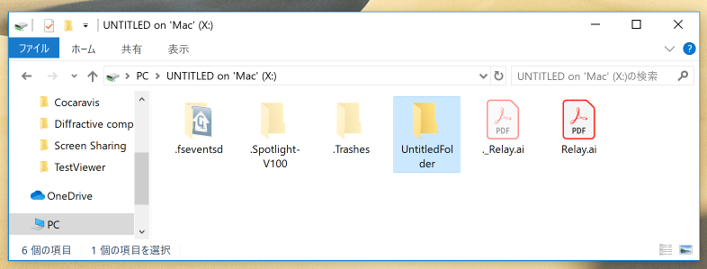
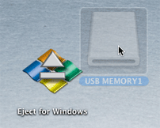
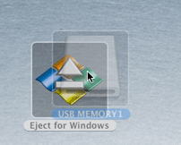
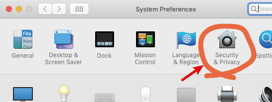
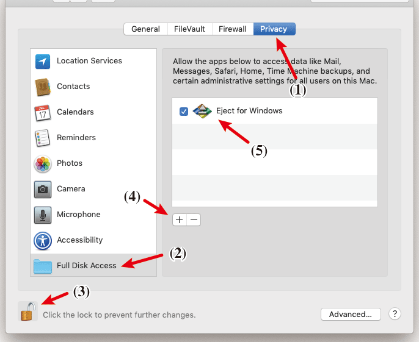

# Eject for Windows


## What is it?

**Eject for Windows** is a small application for macOS that removes hidden files in a USB flash drive mounted on your Desktop and ejects it  (i.e., unmounts it).

**Eject for Windows** got a special Recommendation from Free Download Manager.

[](https://en.freedownloadmanager.org/Mac-OS/Eject-for-Windows-FREE.html)

## Simplified explanation

There are many hidden files in folders on Mac OS X. One of the most is 

```
.DS_Store
```

and this file was once created for each folders but Finder does not display it because it is marked as a hidden file. Many hidden files exist in a volume mounted on macOS but we don't worry about them because they are hidden on default Finder setting.

But it will become problem when files that were created on a Mac are transfered to Windows. Imagine that you want to give your files in your Mac to a Windows user using a flash memory storage drive (USB memory). A Windows user will see many unidentified files in your flash storage device. Of course, such files are perfectly useless for a Windows user.

For example, you can see a flash storage on your Mac



A Windows user will see



**Eject for Windows** is a small macOS application to remove such unnecessary files from a flash storage and then unmount the device.

##How to use it?

Download [zip file](https://github.com/illusiaDecafish/Eject-for-Windows/blob/master/Eject%20for%20Windows.zip) (open the page and push "download" button) and expand to an application bundle, "Eject for Windows.app".

Put **Eject for Windows** on your Desktop or register it in your Dock.



Drag and drop a flash storage icon on it.



Then **Eject for Windows** removes unnecessary files on the device and unmount it (the device icon will disappear). You can take it away physically from USB port on your Mac. That's all.


**Eject for Windows** will do nothing for other normal files. If you drop a folder or a flash storage formatted other then FAT format, **Eject for Windows** will ask you to continue or not.


##Detailed explanation

On your Mac, you can read/write volume with FAT32 format and exFAT format and also can initialize a volume with both formats using Disk Utility. You may use one of these formats for a flash memory storage to transfer or receive files between you and Windows users.

When you insert the device to your USB port of your Mac and you copy files to the device appears on your desktop, your Finder creates many hidden files

| file name                      | content                            | location                 |
| ------------------------------ | ---------------------------------- | ------------------------ |
| .DS_Store                      | infomation for Finder              | each folder              |
| file begins with"._"           | resource forck                     | each file                |
| .Trashes                       | trash folder                       | top level of each volume |
| .Spotlight-V100(or .Spotlight) | data for searching                 | top level of each volume |
| .fseventsd                     | history information of file system | top level of each volume |

These files are useful for Mac system but useless for Windows users. **Eject for Windows** will remove these files and unmount (and then eject) the device.


**Eject for Windows** can treat not only flash memory storage but a device that is 

- removable
- writable
- unmountable

For example, 3.5" floppy disks (if you still have) or external hard disks connected via thunderbolt port.

## for Mojave (macOS 10.14) users

On macOS 10.14 Mojave, **Eject for Windows** can not remove .Spotlight-V100 folder because Apple had changed a policy on volume access on Mojave.

If you who are Mojave users don't want to leave the folder existing in flash storages you should change Security & Privacy setting via System Preferences.



1. click Privacy tab.

2. select "Full Disk Access" capability from side bar listings.

3. unlock key.

4. press "+" button

5. add **Eject for Windows** app in a table.

   

   Then **Eject for Windows** is enabled to remove .Spotlight-V100 folder.

## Known issues

1. a volume with NTFS format can not be treated

2. volume with certain unicode name may be failed to recognaize as a volume

3. its source codes are written in old Objective-C and calls a few APIs that are already obsoleted (but still survive) in latest macOS.

    

##Author's comment

**Eject for Windows** is very old app. The  first version was introduced in 2011 for Mac OS X10.5 and I've left it unmaintained. I'm surprised that such an old app can work even now and there are not a few users loving to use it.

I'm reconsidering to make it up-to-date, but I think I should not add new functions to it because I can suppose the users like its simplicity, not its functions.

Now I'm planning to make **Eject for Windows** "literally up-to-date",i.e.,

1. refactor to Swift from Objective-C coding.
2. abolish the obsolete APIs.

